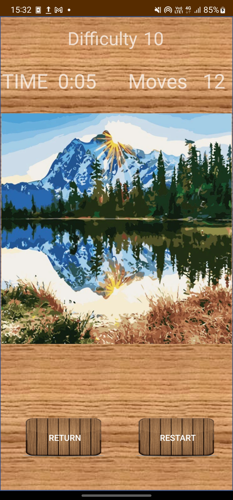
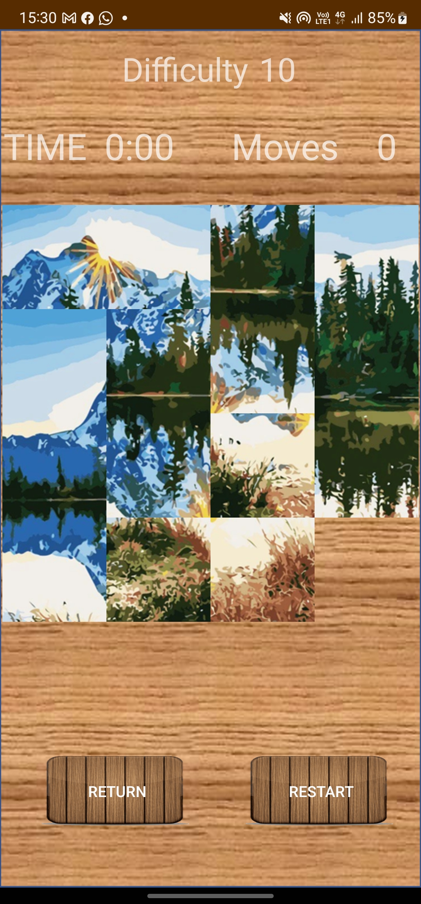

<h1>Board Number Game</h1>

Java based android aplication I wrote in android-studio 

the game is a scrambled image that the player need to organize to be as the original 

The main code files of the project can be found in this link -  https://github.com/nitaymayo/My-Portfolio/tree/main/JAVA/BoardNumberGame/app/src/main/java/com/example/boardnumbergame

<h3>Preview</h3>

</img>
</img>
</img>

